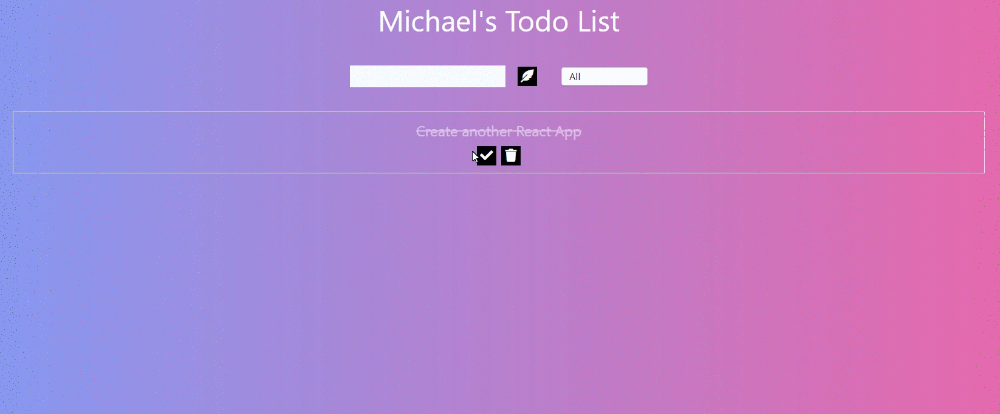

# Todo List App 

# Created with React and stylized with TailwindCSS

In the project directory, you can run:

### `yarn start` or `npm start`

Runs the app in the development mode.\
Open [http://localhost:3000](http://localhost:3000) to view it in the browser.

